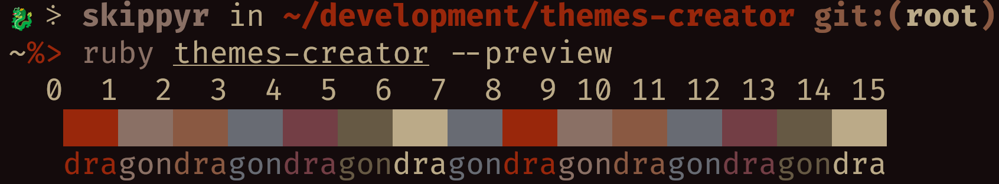
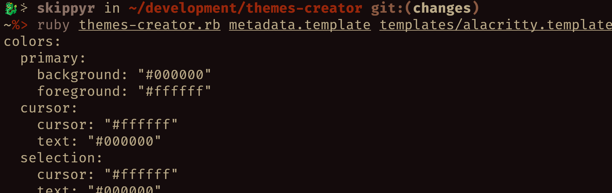

# Themes Creator
## About
A script to create and debug theme files based on templates, specially for terminal emulators. It already comes bundled with some templates.



## Installation
### Dependencies
The following dependencies must be installed to install this software properly:
-   `git`
-   `ruby`

### Procedures
-   Clone this repository.
```bash
git clone --depth=1 https://github.com/skippyr/themes-creator
```

-   Access the repository's directory.
```bash
cd themes-creator
```

## Usage

### Creating Theme From Template
-   Create a file based on the `metadata.template` file in which you will store the metadata of your theme. The lines in that file must follow this convention:

    | Line Number | Description |
    | - | - |
    | 1 | The name of the theme. |
    | 2 | The author of the theme. |
    | 3 | The license the theme is under. |
    | 4 | The URL where the theme will be distributed. |
    | 5 | Color of ANSI 0 (black) (used as background). |
    | 6 | Color of ANSI 1 (red). |
    | 7 | Color of ANSI 2 (green). |
    | 8 | Color of ANSI 3 (yellow). |
    | 9 | Color of ANSI 4 (blue). |
    | 10 | Color of ANSI 5 (magenta). |
    | 11 | Color of ANSI 6 (cyan). |
    | 12 | Color of ANSI 7 (white) (used as foreground). |

    ANSI colors are the reference to create terminal emulator themes. The colors must be in HEX format, starting with the `#` character and without opacity attributes. Their case does not matter. For example: `#ff0000` is a valid one.

-   Take a look inside of the `templates` directory and choose a template for you to use. Each one of them creates a theme for one application. Alternatively, you can use a custom one that you have created.

-   Use the script passing the paths of your metadata file and of the template you have chosen as arguments. For example: you can create a theme for Kitty using the `metadata.template` file.
```bash
ruby themes-creator metadata.template templates/kitty.template
```

### Creating A Template
You can create your own templates to create more themes. For that, simply write a file possibly containing the following placeholders:

| Placeholder | Replaced By |
| - | - |
| `~%{name}%~` | The name of the theme. |
| `~%{author}%~` | The author of the theme. |
| `~%{license}%~` | The license the theme is under. |
| `~%{url}%~` | The URL where the theme will be distributed. |
| `~%{black}%~` | Color of ANSI 0 (black) (used as background). |
| `~%{red}%~` | Color of ANSI 1 (red). |
| `~%{green}%~` | Color of ANSI 2 (green). |
| `~%{yellow}%~` | Color of ANSI 3 (yellow). |
| `~%{blue}%~` | Color of ANSI 4 (blue). |
| `~%{magenta}%~` | Color of ANSI 5 (magenta). |
| `~%{cyan}%~` | Color of ANSI 6 (cyan). |
| `~%{white}%~` | Color of ANSI 7 (white) (used as foreground). |

After creating it, you can start using it with the script and a metadata.

If you need some references, you can always take a look in the source code of the templates under the `templates` directory to see how they look like.

### Testing Terminal Emulator Themes
You can test your terminal emulators themes using the preview within the script:
```bash
ruby themes-creator --preview
```

### Quick Help Instructions
You can always remind yourself of how to use the script by reading its help instructions:
```bash
ruby themes-creator --help
```

## Copyright
This software is under the MIT license. A copy of the license is bundled with the source code.
