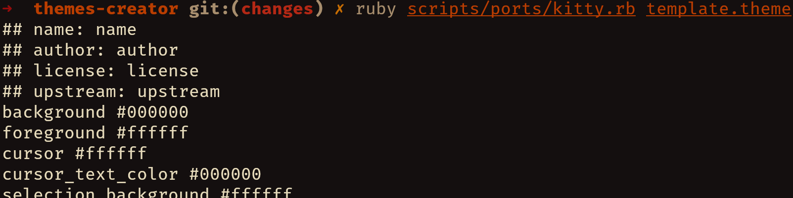
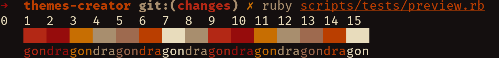

# Themes Creator

## About

A collection of scripts to easily create and debug theme files for terminal
emulators. By the way, these are also the tools that helps me maintain my
theme: [Flamerial](https://github.com/skippyr/flamerial).





## Installation

### Dependencies

The following dependencies must be installed to run this sofware properly:

| Name | Description |
| - | - |
| git | Required to download this repository. |
| ruby | Required to run the scripts. |

### Installation

- Clone this repository.

```bash
git clone --depth=1 https://github.com/skippyr/themes-creator
```

- Access the repository's directory.

```bash
cd themes-creator
```

## Usage

- The first thing to do is to create a file to store your theme's metadata.
  The lines of that file needs to follow this structure:

  | Line Number | Description |
  | - | - |
  | 1 | The name of the theme. |
  | 2 | The author of the theme. |
  | 3 | The license the theme is under. |
  | 4 | The URL of the upstream where the theme will be distributed. |
  | 5 | The color correspondent to ANSI 0 (black) (background)
  | 6 | The color correspondent to ANSI 1 (red)
  | 7 | The color correspondent to ANSI 2 (green)
  | 8 | The color correspondent to ANSI 3 (yellow)
  | 9 | The color correspondent to ANSI 4 (blue)
  | 10 | The color correspondent to ANSI 5 (magenta)
  | 11 | The color correspondent to ANSI 6 (cyan)
  | 12 | The color correspondent to ANSI 7 (white) (foreground)

  ANSI colors are the reference for developers to produce terminal emulators'
  themes.

  All the colors you use must be in HEX format, containing a `#` as the first
  character. You can use either upper or lower case characters.

  Apart from the background and foreground colors, you do not need to strictly
  respect the reference: for example, you can use a yellow color as ANSI 4
  (blue) without having an issue. This opens room for you to explore basically
  whatever combination you want.

  To help you create this file, there is the `template.theme` that you can
  use either as a template or to test the scripts: it contains a generic
  high-contrast dark theme.

- After you have created your metadata file, take a look in the contents of the
  `scripts/ports` directory. There you will find all the available scripts
  that can create ports of your theme.

  To create a port, run the desired script and use the path to your metadata
  file as an argument. For example, to create a Kitty theme using the template
  file:

  ```bash
  ruby scripts/ports/kitty.conf template.theme
  ```

  Like this, the theme file will be printed to `stdout`, but you can add one
  more argument to your commands: the path of a file where the theme should
  be stored instead. Theme files that are meant to be scripts, will
  be turned into executables automatically once created.

- After you have created your ports, if you need, you can use the
  `scripts/test/preview.rb` script to have a preview of your current terminal
  emulator's theme.

- Now, you are ready to start distributing ports of your theme.

## Support

Report issues, questions or suggestions through the [issues tab](https://github.com/skippyr/chinatown/issues).

## Copyright

This software is licensed under the MIT License. A copy of the license is
bundled with the source code.

Copyright (c) Sherman Rofeman. MIT license.

