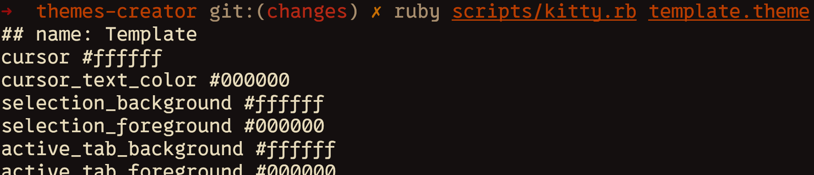

# Themes Creator

## About

A collection of scripts to easily create theme files for terminal emulators and
other applications. These are the tools that also support my theme:
[Flamerial](https://github.com/skippyr/flamerial).



## Installation

### Dependencies

This software requires that the following dependencies are installed to run
properly:

| Dependency | Description |
|-|-|
| ruby | required to run the scripts. |
| git | required to clone this repository. |

### Procedures

- Clone this repository.

```bash
git clone --depth=1 https://github.com/skippyr/themes-creator
```

- Access the repository's directory.

```bash
cd themes-creator
```

## Usage

- Start by creating a file in which you will store the metadata of your theme.
  Its lines must follow this convention:

  | Line | Description |
  |-|-|
  | 1 | The name of the theme. |
  | 2 | The author of the theme. |
  | 3 | The license of the theme. |
  | 4 | The upstream of the theme. |
  | 5 | Color of ANSI 0 (Black) (Background) |
  | 6 | Color of ANSI 1 (Red) |
  | 7 | Color of ANSI 2 (Green) |
  | 8 | Color of ANSI 3 (Yellow) |
  | 9 | Color of ANSI 4 (Blue) |
  | 10 | Color of ANSI 5 (Magenta) |
  | 11 | Color of ANSI 6 (Cyan) |
  | 12 | Color of ANSI 7 (White) (Foreground) |

  All the colors must use HEX format. The colors that you choose do not
  necessarily need to follow the specification of the ANSI colors.

  You can use the `template.theme` as a reference to start creating
  your own: that is a generic high contrast dark theme.

- Run the script of the desired application that you want to create the theme
  for. All the scripts are under the `scripts` directory. In this example, a
  theme for Kitty will be created from the template file.

  ```bash
  ruby scripts/kitty.rb template.theme
  ```

  The first argument must be the path to your metadata file. The second
  argument will be the path of a file where the theme will be stored. If not
  given, it will print the theme to `stdout`.

  If the theme file that you create is intended to be a script, it will
  be automatically turned into an executable.

## Support

Report issues, questions or suggestion through the [issues tab](https://github.com/skippyr/flamerial/issues).

## Copyright

You are free to decide what license to apply your themes under.

This software is distributed under the MIT license. A copy of the license is
bundled with the source code.

Copyright (c) Sherman Rofeman. MIT license.
